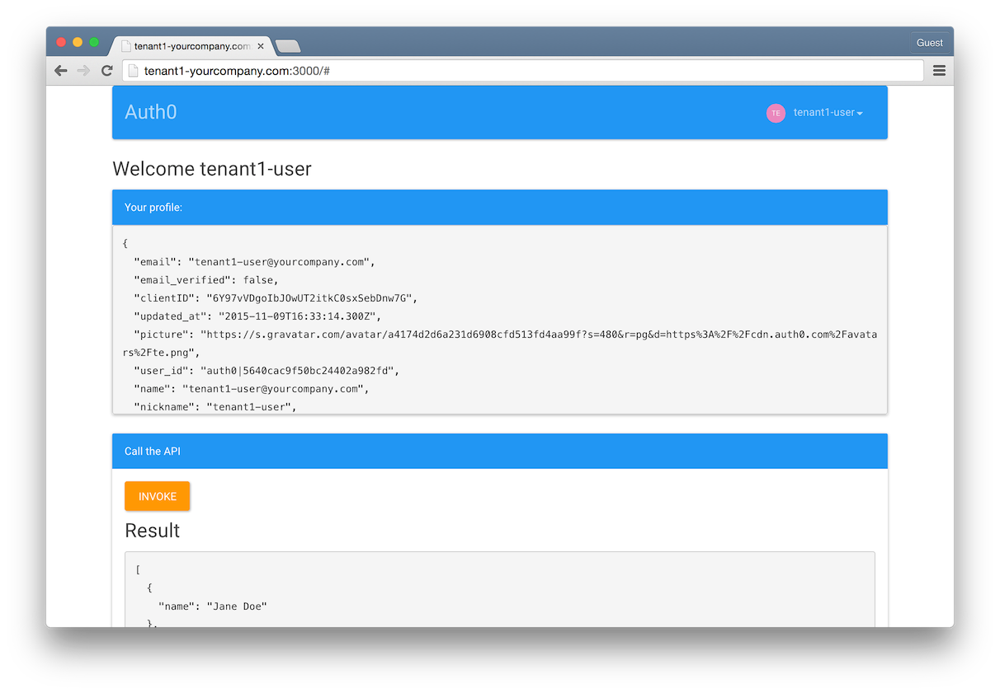
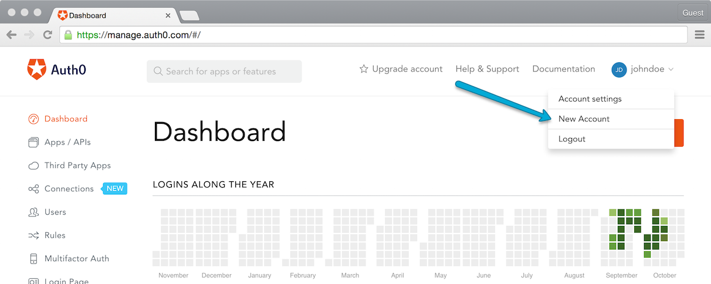
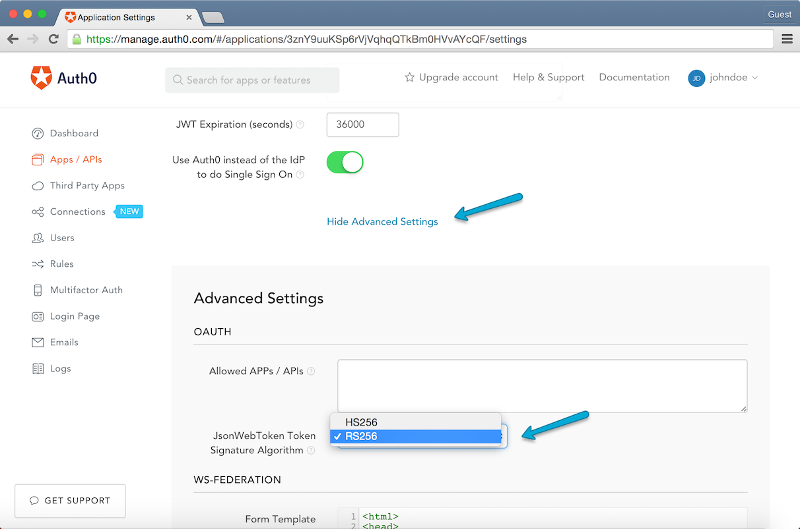

# Auth0 Multitenant App sample

This sample shows how to implement a multi-tenant scenario, where:

* A single instance of a jQuery SPA + a Node.js API serves multiple customers (tenants).
* Each tenant has its own Auth0 account, so they can have access to the Auth0 Dashboard. 
* Each tenant configures its own Auth0 connections for authenticating its users, and for calling third party APIs.
* Each customer accesses the App using a different domain. The tenant name is extracted from the domain.

You can read more about multi-tenant scenarios here: [https://auth0.com/docs/saas-apps](https://auth0.com/docs/saas-apps).

The API is based on this sample: [https://github.com/auth0/multitenant-jwt-auth](https://github.com/auth0/multitenant-jwt-auth).

## Features

The SPA is able to:

* Extract tenant name from domain
* Provide Login functionality using the tenant specific Auth0 settings
* Call the API using the JWT obtained after login

The API is able to:

* Authenticate users using JWTs
* Validate JWTs signed with symmetric keys (**HS256** protocol)
* Validate JWTs signed with asymmetric keys (**RS256** protocol)
* Support multiple tenants, identified by the JWT's **issuer** claim.

## How it works

### SPA Client

The client is a node.js express app. The only code executing server side is the one for:

* Obtaining the tenant name from the domain.
* Obtaining the auth0 domain and clientId from the tenant storage using the tenant name.
* Serving the index view (using **Jade** template engine) along with the `loginConfig` that will be used for authenticating the users.

```js
function getTenantFromDomain(host){
  var re = new RegExp(/(\w+)-yourcompany.com$/);
  var matches = host.match(re);
  if (matches && matches.length > 1){
    return matches[1];
  }
  return null;
}

app.get('/', function(req, res, next) {
  var tenantName = getTenantFromDomain(req.hostname);
  if (!tenantName) return next('Invalid domain: ' + req.hostname);

  var tenantConfig = _.find(tenants,'name',tenantName);
  if (!tenantConfig) return next('Invalid Tenant ' + tenantName);
  var loginConfig = {
    auth0Domain:tenantConfig.auth0Domain,
    auth0ClientId:tenantConfig.auth0ClientId
  };
  res.render('index', loginConfig);
});
```

Once the initial page is rendered, the app continues as a JQuery Single Page App. It uses the `auth0Domain` and `auth0ClientId` obtained from server side to configure a new instance of **Lock**, which will be used to perform the Login.

```jade
block content  
  .login-box
    h1 Auth0 Multitenant Sample
    p Login to start using the resources available for your tenant
    br
    button(onclick="signin()") Login

  script.
  	var lock = new Auth0Lock('#{auth0ClientId}','#{auth0Domain}');
    
    function signin() {
      lock.show();
    }

    //handle redirection from identity provider after login
    $(document).ready(function() {
      var hash = lock.parseHash();
      if (hash) {
        if (!hash.error) {
          localStorage.setItem('id_token', hash.id_token);
          reloadProfile(hash.id_token);                     
        }
      } 
``` 

The JWT token received on the login is saved to localStorage and will be used later to invoke the API. It is also used to fetch the user's profile.



### API

The custom API uses [express-jwt](https://github.com/auth0/express-jwt) for validating JWTs. 

```js
var expressJwt = require('express-jwt');
var express = require('express');
var app = express();

app.use('/api', expressJwt({
  secret: secretCallback,
  algorithms: [ 'HS256','RS256'] //the 2 algorithms supported by Auth0
}));
```

Because of the multi-tenant support, the secret used to sign tokens is not static and hence a `secretCallback` is used. The secretCallback supports verifying tokens signed with **HS256** algorithm (clientId) and **RS256** (asymmetric keys). It uses an LRU cache to store the secrets. 

```js
function secretCallback (req, header, payload, cb){
	var cacheKey = payload.iss + '|' + payload.aud ;
  var cachedSecret = secretsCache.get(cacheKey);
  if (cachedSecret) { 
    return cb(null, cachedSecret);
  }

  var tenant = data.getTenantByIssuer(payload.iss);
  if (!tenant) { 
    return cb(new Error('Invalid issuer '+payload.iss)); 
  }

  switch (header.alg) {
    case 'HS256': //client secret
      var secret = new Buffer(tenant.secret, 'base64');
      secretsCache.set(cacheKey, secret);
      return cb(null, secret);
    case 'RS256': // asymmetric keys
      var url = payload.iss + '.well-known/jwks.json';
      request.get(url, { json: true, strictSSL: false }, function (err, resp, jwks) {
        if (err) {
          return cb(err);
        }
        if (resp.statusCode !== 200) {
          return cb(new Error('Failed to obtain JWKS from ' + payload.iss));
        }
        var key = _.find(jwks.keys, function(key) {
          return key.kid == header.kid;
        });
        if (!key) {
          return cb(new Error('Failed to obtain signing key used by ' + payload.iss));
        }
        var publicKey = certToPEM(key.x5c[0]);
        secretsCache.set(cacheKey, publicKey);
        return cb(null, publicKey);
      });
      break;
    default:
      return cb(new Error('Unsupported JWT algorithm: ' + header.alg));
  }
}
```

The API provides a sample secured endpoint for getting a list of users specific for the tenant:

```js
app.get('/api/users',
  tenantMiddleware(), //adds tenant's name to req from JWT's issuer claim
  function (req, res, next) {
    data.getUsersByTenantIdentifier(req.tenantName, function(err, users){
      if (err) return next(err);
      res.json(users);
    });
});
```

The tenant middleware adds the tenantName to the request. It obtains the tenant from the tenant store, using the JWT's issuer as a key:

```js
var data =require('./data');

module.exports = function(app){
  return function addTenant(req, res, next){
    var tenant = data.getTenantByIssuer(req.user.iss);
    req.tenantName = tenant.name;
    next();
  };
};
```

## Run the sample locally in a dev environment

### 1. Modify hosts file

In order to emulate a multi-tenant environment, add the following entries to your machine's **hosts** file:

```
127.0.0.1 tenant1-yourcompany.com
127.0.0.1 tenant2-yourcompany.com
```

### 2. Create the Auth0 accounts

Each tenant needs its own Auth0 account. If the tenant already has an account it can use the existing one. Otherwise you can provision an account for him. You can create new accounts from the Auth0 master account, under the user's menu > **New Account** option.



You can name each tenant as `tenantname-yourcompany.auth0.com`. 

### 3. Configure each Auth0 account

For each of the Auth0 accounts:

* Make sure there is at least one Auth0 Application and take note of its **clientId**.
* Make sure there is at least one **Idenity Provider** enabled for users to login.
* Take note of the Applications **ClientSecret**. It will be used by the API to validate the tokens.
	
  Alternatively, if the client doesn't want to share the secret, the API can validate tokens using the public key. In this case make sure they selected **RS256** under **Show Advanced Settings > JsonWebToken Token Signature Algorithm**
  

* Add the SPA domain to the **Allowed Callback URLs**. i.e: `http://tenant1-yourcompany.com:3000`

### 4. Configure the Tenants Mapping

Create a tenants.js file using tenants-sample.js as a template. For each tenant provide:

* The Auth0 domain
* The Auth0 ClientId
* The Auth0 ClientSecret (optional - don't needed if tokens are signed using an asymmetric key)

Example with tenant1 using its own auth0 domain and using asymetric keys and tenant2 having an auth0 account provisioned by your company and using the client secret:

```
module.exports = [
  {
    name: 'tenant1',
    auth0Domain: 'tenant1-custom-domain.auth0.com',
    auth0ClientId:'6Y97vVD...C0sxSebDnw7R'
  },
  {
    name: 'tenant2',
    auth0Domain: 'tenant2-yourcompany.auth0.com',
    auth0ClientId:'VIRUMI46...lU8f7d62s4',
    secret: 'TUtF1F28Tage...SIMPhdQZuSy'
  }
];
```

### 5. Install and Run the Single Page App

1. Open a terminal and go to the SPA folder
2. Install dependencies with `npm install`
3. Run the app with `npm start`

### 6. Install and Run the API

1. Open another terminal and go to the API folder
2. Install dependencies with `npm install`
3. Run the app with `npm start`

### 7. Use the App!

1. Navigate to `http://tenant1-yourcompany.com:3000`, login with tenant1's crentials and call the API. You should see the data associated with tenant1.
2. Navitage to `http://tenant2-yourcompany.com:3000` and do the same for tenant2.

## What is Auth0?

Auth0 helps you to:

* Add authentication with [multiple authentication sources](https://docs.auth0.com/identityproviders), either social like **Google, Facebook, Microsoft Account, LinkedIn, GitHub, Twitter, Box, Salesforce, amont others**, or enterprise identity systems like **Windows Azure AD, Google Apps, Active Directory, ADFS or any SAML Identity Provider**.
* Add authentication through more traditional **[username/password databases](https://docs.auth0.com/mysql-connection-tutorial)**.
* Add support for **[linking different user accounts](https://docs.auth0.com/link-accounts)** with the same user.
* Support for generating signed [Json Web Tokens](https://docs.auth0.com/jwt) to call your APIs and **flow the user identity** securely.
* Analytics of how, when and where users are logging in.
* Pull data from other sources and add it to the user profile, through [JavaScript rules](https://docs.auth0.com/rules).

## Create a free Auth0 Account

1. Go to [Auth0](https://auth0.com) and click Sign Up.
2. Use Google, GitHub or Microsoft Account to login.

## Issue Reporting

If you have found a bug or if you have a feature request, please report them at this repository issues section. Please do not report security vulnerabilities on the public GitHub issue tracker. The [Responsible Disclosure Program](https://auth0.com/whitehat) details the procedure for disclosing security issues.

## Author

[Auth0](auth0.com)

## License

This project is licensed under the MIT license. See the [LICENSE](LICENSE) file for more info.